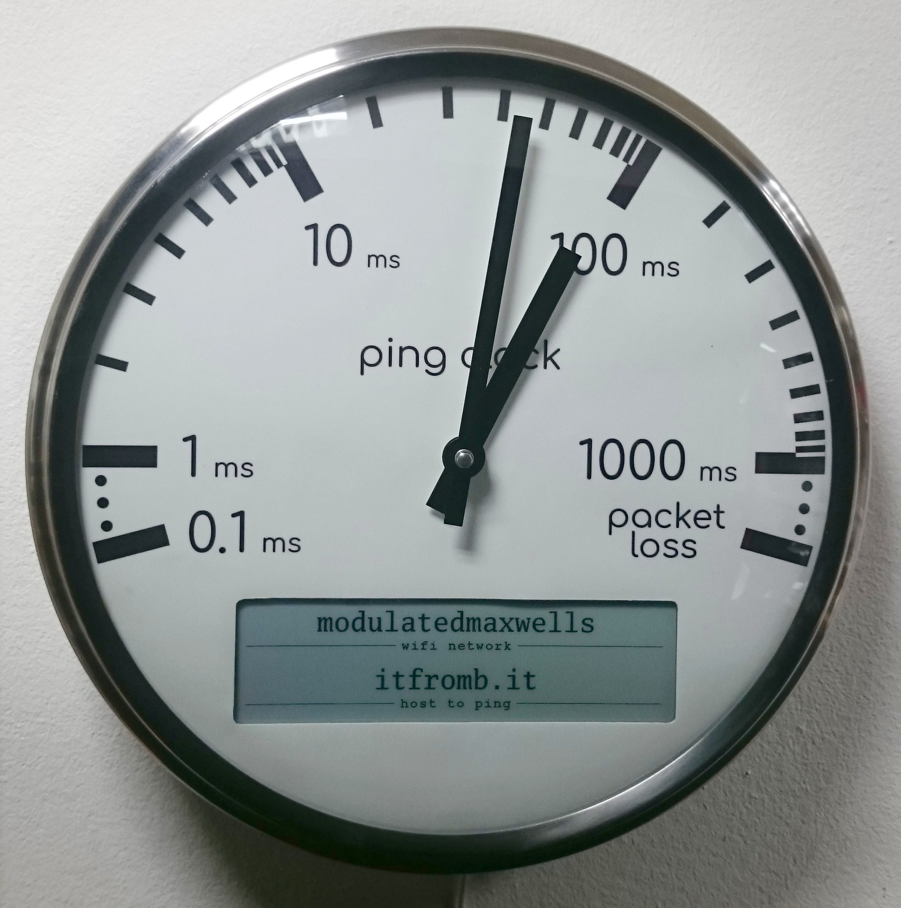
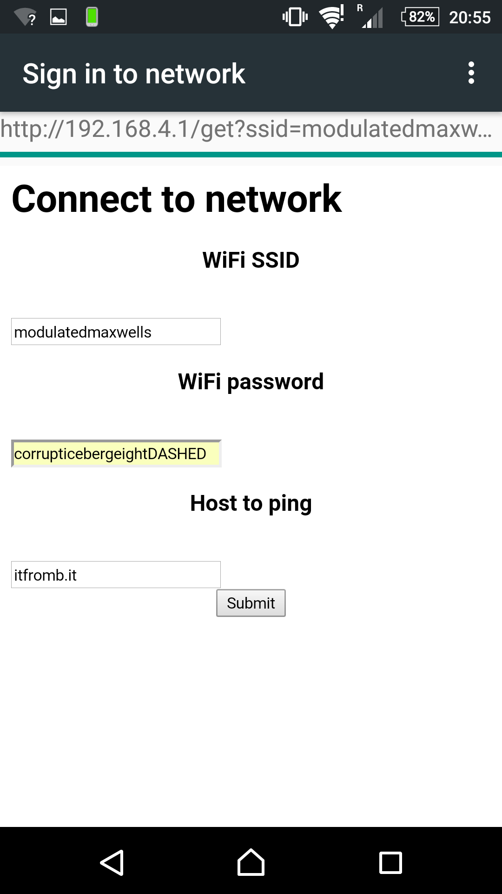
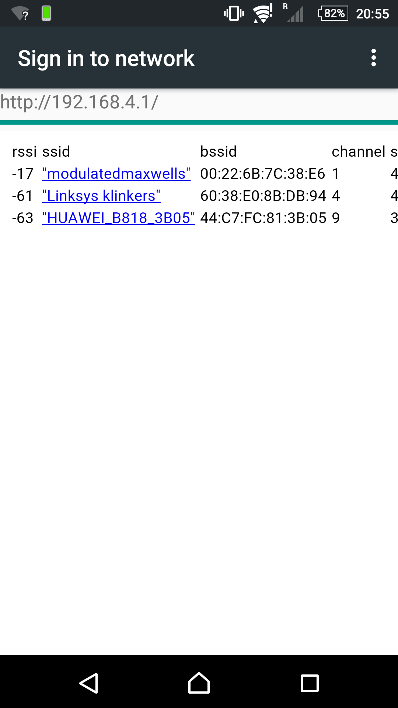
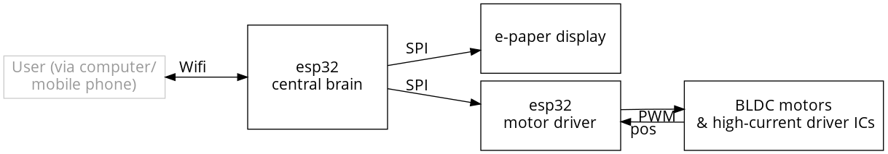
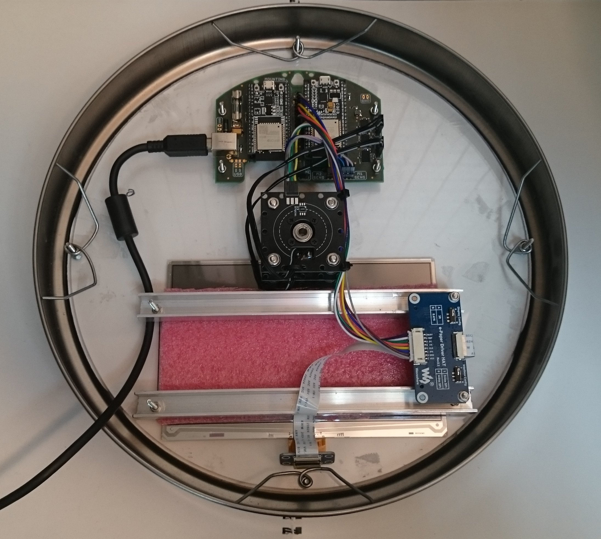
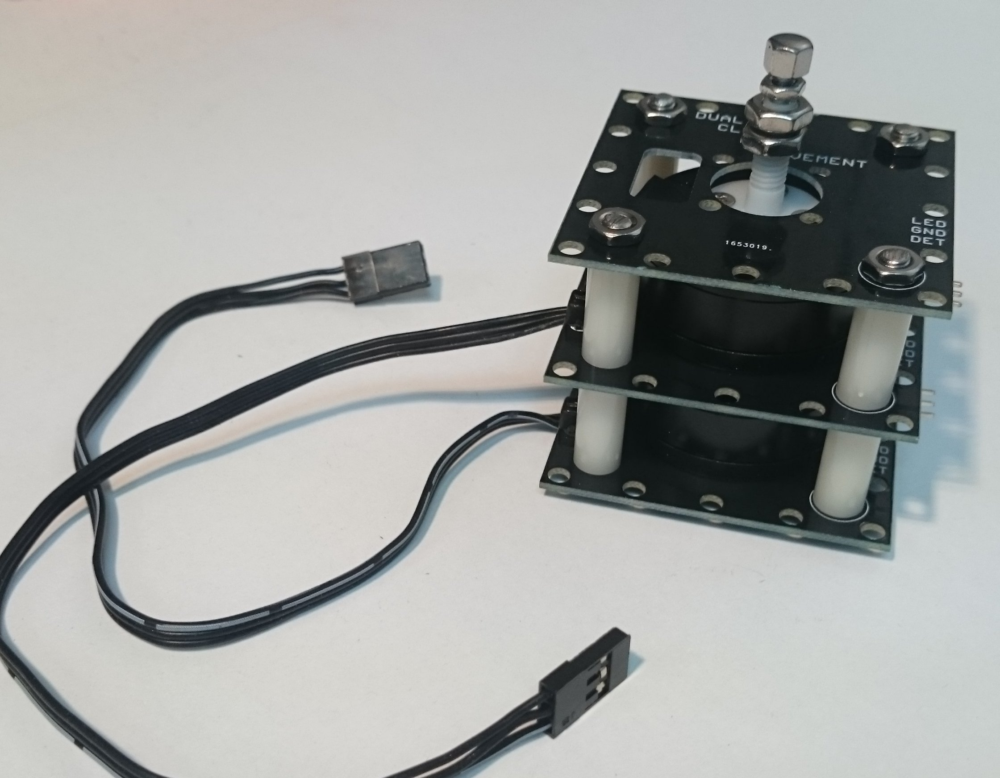
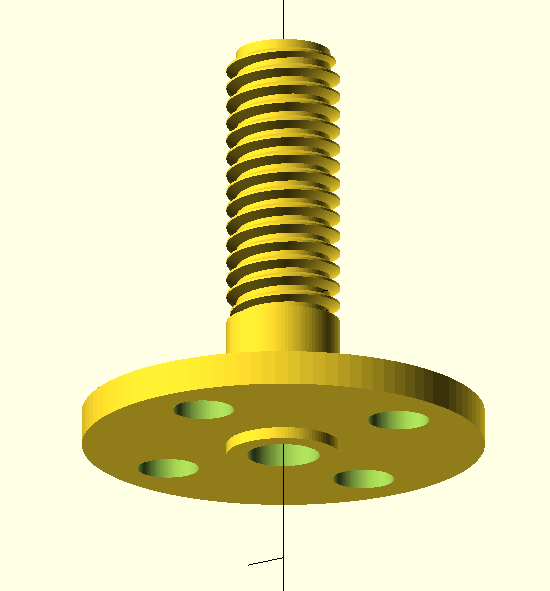
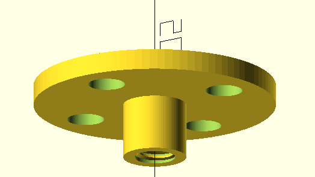
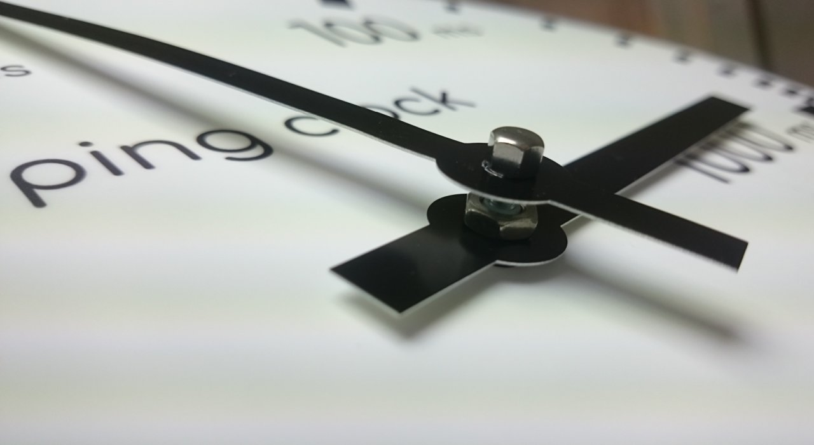

The Ping Clock
==============

Are you ever in a video call, when the other party suddenly freezes mid-sentence, leaving you wondering after a few seconds of silence: is it my connection that's having issues, or theirs? In such situations, one glance at the ping clock dial provides an immediate overview of your internet connection status and health, measured in terms of ping time.

Ping time is the time it takes for a network packet to reach a certain destination host and come back again. Lower is better; for video calls, anything below a few tenths of a second is typically fine. The host can be chosen as a public server with high reliability (for example, google.com or 80.80.80.80), or as something with a special significance (like the hostname of your cloud instance).

If your video call freezes, but the ping clock continues to indicate low ping, there is no need to reset your router; just wait for the other side to come back.

.. table::
   :align: center

   +-------------------------------------------------------------------------------------------------------------------------------------------------------------+
   | 🢧  `Click here for a video of the ping clock in action <https://github.com/turingbirds/ping-clock/blob/master/fig/ping_clock_movie.mp4?raw=true>`_        🢠 |
   +-------------------------------------------------------------------------------------------------------------------------------------------------------------+

Setting up the wifi network and host to ping is done by connecting to the ping clock's wifi access point. After configuration, the outermost hand will update once each second with the latest ping value, while the innermost hand tracks the recent maximum pings, making an intermittent connection easy to see.

.. table::
   :align: center

   +---------------+---------------+
   | |screenshot1| | |screenshot2| |
   +---------------+---------------+

Hardware
--------

The system is controlled by an ESP32, which connects via wifi and updates the e-paper display, and then performs the ping, computes the desired clock hand angles, and sends this angle via SPI to a second ESP32, which functions exclusively as a motor controller.

For mounting the components to the frontplate, a template is provided in `frontplate-cad/frontplate_cnc.pdf <https://github.com/turingbirds/ping-clock/blob/master/frontplate-cad/frontplate_cnc.pdf>`_. Drill out all the holes marked in pink, then drill out all the M3 screw holes at half depth in a larger diameter, to create holes for the countersunk screw heads. The frontplate decal then lies flat against the front, covering all the screws. The front of the e-paper display is pressed against the back of the faceplace, held in place by two aluminium bars covered in a layer of foam.
   

The clock is powered from a 5 V DC supply, and consumes approximately 2 W of power. The ESP32s and motor driver ICs are mounted on a custom PCB (see `pcb/ping_clock_mounting_pcb.* <pcb/>`_). 

Dual clock hands motor module
~~~~~~~~~~~~~~~~~~~~~~~~~~~~~

Each hand is actuated by a three-phase brushless DC (BLDC) motor. Actuation is 'direct drive': the hands are mounted directly onto the rotating surface of the motors via two 3D printed hubs.

BLDC motors can be easily controlled as open-loop servos (akin to stepper motors), with reliable tracking over long timescales provided that the load torque is minimal and that acceleration is bounded. An optical reflection light sensor provides an absolute reference point or 'zero angle'. The motor controller ESP32 generates three-channel PWM drive signals for each motor, following a trapezoidal commutation scheme.

PCBs are 1.2 mm, with black solder mask to reduce ambient light for the optical sensors. All three PCBs (`pcb/motor_module_pcb.* <pcb/>`_) are identical, but only two of them need to have a reflection sensor mounted. The dimensions (width x depth x height) of the assembly, ignoring the protruding hubs, is 50 x 50 x 44 mm. The height is 2 * 18 (spacers) + 3 * 1.2 (PCBs) + 2 * 2.2 (thin M4 nuts) = 44 mm.

Hubs
~~~~

The hubs can be 3D printed using the stereolithographic (resin/UV) method. The outer hub is shown first and contains an outer M5 thread to facilitate mounting the corresponding hand. It has a hollow core, which allows the threaded rod of the inner hand assembly to pass through.

The inner hub provides an inner M3 thread, that seats a short section of threaded rod, which sticks through the other hub and to the front of the clock faceplate.

The hands are mounted using the threads provided:

- Central axis: M3 (3 mm diameter) threaded rod

  The hand is pressed between a thin M3 nut and an M3 capped nut.

- Hub axis: M5 (5 mm diameter), threaded
  
  The hand is pressed between two thin M5 nuts. A single M5 rivet could potentially also be used, extending into the clock, to reduce the height that is necessary above the faceplate.

It is advisable to post-process the 3D printed threads by going over the threads with an M3 and M5 tap, and to drill out the hollow core on the outer hub using a 3.2 mm drill.

Frontplate
~~~~~~~~~~

The frontplate is made out of polycarbonate, in a circular shape, thickness = 4 mm, diameter = 275 (visible portion) + 2*7.5 (behind the metal rim on either side) = 290 mm.

The frontplate graphics can be printed on A3 size paper. A better alternative is to get it as a vinyl sticker.

Note that not all of the display pixels are visible with the current cutout dimensions. This is by design, but you can make the cutout larger to reveal a larger area of the display.

Rim
~~~

Reused from Ikea clock, diameter = 275 mm (dial), 300 mm (overall).

Bill of materials
-----------------

Hardware
~~~~~~~~

(shipping costs excluded)

.. csv-table:: Bill of materials
   :header: "€", "Description"

   "57.19", "7.5"", 800x480 pixel e-paper display https://www.waveshare.com/w/upload/6/60/7.5inch_e-Paper_V2_Specification.pdf"
   "14.92", "Frontplate https://kunststofplatenshop.nl/product/polycarbonaat-helder-4-mm/"
   "6.20", "TB6612FNG motor driver IC (qty: 3)"
   "4", "SFH9201 optical sensor (qty: 2)"
   "7.71", "motor assembly PCBs, color: black, thickness: 1.2mm (seeedstudio; qty: 3)"
   "1.66", "3D printing of the hubs (dirtypcbs.com)"
   "5", "System PCB, color: any, thickness: 1.6 mm (seeedstudio)"
   "14", "frontplate laser-cut vinyl sticker (note: printing this on A3 size paper and cutting it out by hand is a cheaper alternative)"
   "0.10", "motor position sticker (qty: 2)"
   "1", "screws 2mm flat head (qty: 8)"
   "1", "screws 2.5mm flat head (qty: 8)"
   "1", "screws 3mm countersunk head (qty: 16)"
   "1", "M3 nut (qty: 36)"
   "1", "thin M4 nut (qty: 8)"
   "0.50", "M3 threaded rod"
   "1", "M4 threaded rod"
   "0.10", "thin M5 nut (qty: 2)"
   "0.10", "thin M3 nut"
   "0.10", "M3 capped nut"
   "0.55", "vinyl spacer, h = 18 mm, inner d = 4 mm, outer d = 7 mm (qty: 8)"
   "13.69", "BLDC motor with hollow axis (qty: 2)"
   "7.14", "ESP32-DEVKIT (qty: 2)"
   "1", "USB-A PCB mount connector"
   "1", "500 mA fuse and holder"
   "1", "0.1"" IDC headers"
   "1", "0.1"" IDC cables"
   "0.10", "470 R resistor 1206 (qty: 3)"
   "0.10", "47k R resistor 1206 (qty: 2)"
   "0.10", "100 nF capacitor 1206 (qty: 10)"
   "0.10", "10 uF tantal capacitor SMD"
   "5", "Ikea clock (second hand, for the rim and glass)"
   "", ""
   "148.36", "**Total**"

Software
~~~~~~~~

Comfortaa font <aajohan@gmail.com> SIL Open Font License, Version 1.1

Luxi font copyright (c) 2001 by Bigelow & Holmes Inc.

Ping code from https://github.com/marian-craciunescu/ESP32Ping (LGPL-2.1 license).

log2fix code from https://github.com/dmoulding/log2fix (MIT license).

Credits
-------

With gratitude to `Jan Breemer <http://www.breem.nl/>`_ for debugging the 3D model of the hubs and help with the prototype!

License
-------

`Open source hardware <https://www.oshwa.org/>`_ is hardware for which the design is made publicly available, so that anyone can study, modify, distribute, make, and sell the design or hardware based on that design, subject to the following license conditions.

Hardware licensed under the *CERN Open Hardware Licence Version 2 - Weakly Reciprocal,* a copy of which is included in this repository at `cern_ohl_w_v2.txt <https://github.com/turingbirds/ping-clock/blob/master/cern_ohl_w_v2.txt>`_.

Software licensed under the *Apache License 2.0,* a copy of which is included at `apache_license_2.0.txt <https://github.com/turingbirds/ping-clock/blob/master/apache_license_2.0.txt>`_.
